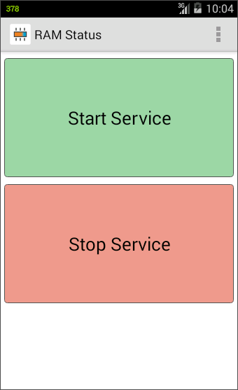

# RAM Status

Shows available memory in the status bar

If you'd like to make a donation via **PayPal** or with a **Credit Card**:  

## Download

- [**releases**](https://github.com/mortalis13/RAM-Status-Android/releases)

## Screenshots

 
